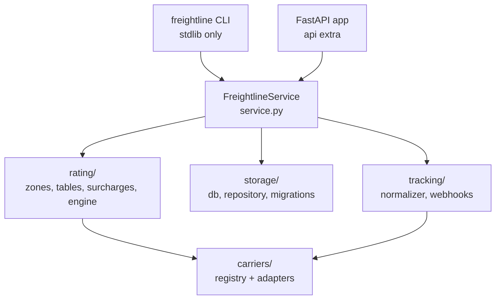

# Freightline architecture

Freightline rates, books, and tracks parcel shipments across a panel of carriers.
It is a single deployable: one FastAPI process, one SQLite database, one CLI.

## Layers



Rules that hold across the whole codebase:

- **The domain never imports the API.** `freightline.api` may import anything;
  nothing imports `freightline.api`. That is what keeps the CLI installable
  without FastAPI.
- **`service.py` is the only composition point.** The API and the CLI each
  contain transport concerns and nothing else.
- **Money is integer cents.** `freightline.money.Money` is the only monetary
  type. Decimals appear during a calculation; floats appear nowhere.
- **Rating is table-driven.** Carrier adapters describe identity and vocabulary.
  Prices live in `rating/tables.py`.

## Rating pipeline

```
QuoteRequest
  -> resolve_zone(origin, destination)          rating/zones.py
  -> billable_weight_kg(request, rate)          rating/engine.py
  -> base_charge(rate, zone, weight)            rating/engine.py
  -> build_lines(request, base)                 rating/surcharges.py
  -> Quote(lines, total)
```

Surcharges run in registration order and accumulate: each one is handed the
running subtotal. `FuelSurcharge` is last and is a percentage, so it compounds
on every flat surcharge above it. That ordering is load-bearing and is asserted
in `tests/test_surcharges.py`.

## Carrier panel

| Code | Name | Services | Tracking format | Intl | Saturday |
| --- | --- | --- | --- | --- | --- |
| `atlas` | Atlas Freight | ground, express, overnight | `ATL` + 12 digits | yes | yes |
| `borealis` | Borealis Air | express, overnight | `BX` + letter + 9 digits | yes | yes |
| `pigeon` | Pigeon Post | economy, ground | `PGN` + 10 digits (legacy `PP` + 9) | no | no |

Adding a carrier is deliberately a checklist, and the checklist is executable:
`tests/test_carrier_contract.py` parameterises every rule over the registry, so
registering an adapter immediately tells you what else is missing.

1. Adapter module in `src/freightline/carriers/`, subclassing `BaseCarrier`.
2. Registration in `carriers/registry.py`.
3. Rate card in `rating/tables.py` covering **every** advertised service and
   **every** zone 1–8.
4. `STATUS_MAP` reaching all six canonical `ShipmentStatus` values.
5. A `tracking_template` whose generated numbers validate against
   `tracking_pattern`.
6. A row in the table above.

## Status vocabulary

Carriers each have their own scan codes. `tracking/normalizer.py` collapses them
into six canonical values so nothing downstream branches on carrier identity:

`created` → `in_transit` → `out_for_delivery` → `delivered`, with `exception`
and `returned` reachable from any point.

## Storage

Forward-only SQL migrations in `storage/migrations/`, applied in filename order
and recorded in `schema_migrations`. There are no down-migrations; a rollback is
a new forward migration.

`ShipmentRepository` is the only module that writes SQL. Every value is a bound
parameter. The only identifiers interpolated into a statement are drawn from
`SORTABLE_COLUMNS` and `SORT_DIRECTIONS`, which is why `search()` validates
against those allow-lists rather than passing user input through.

## Known debt

| Area | Issue | Tracked in |
| --- | --- | --- |
| `carriers/pigeon.py` | Predates `BaseCarrier`; raises `ValueError` instead of `ValidationError`; duplicates normalisation logic | `docs/adr/0003-legacy-pigeon.md` |
| `rating/zones.py` | Postal-prefix bands are an approximation of the published zone matrices | `docs/adr/0002-zone-resolution.md` |
| `api/routes_admin.py` | Reports read at most `REPORT_LIMIT` shipments; there is no streaming export | — |
